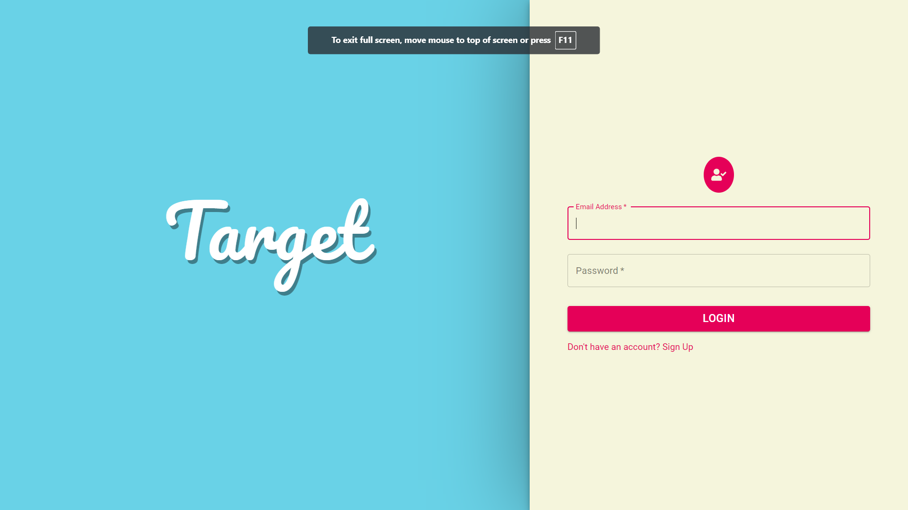
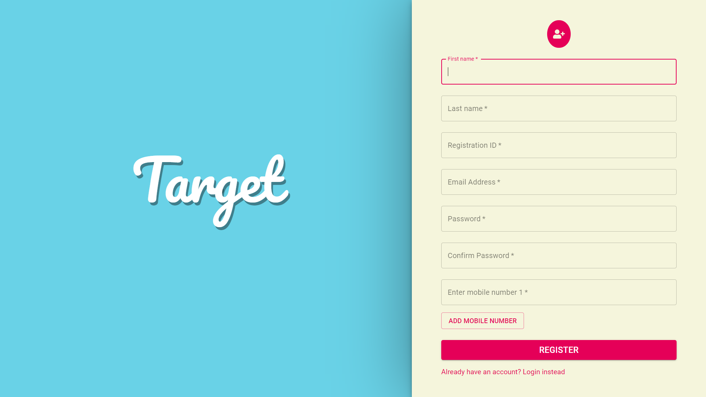
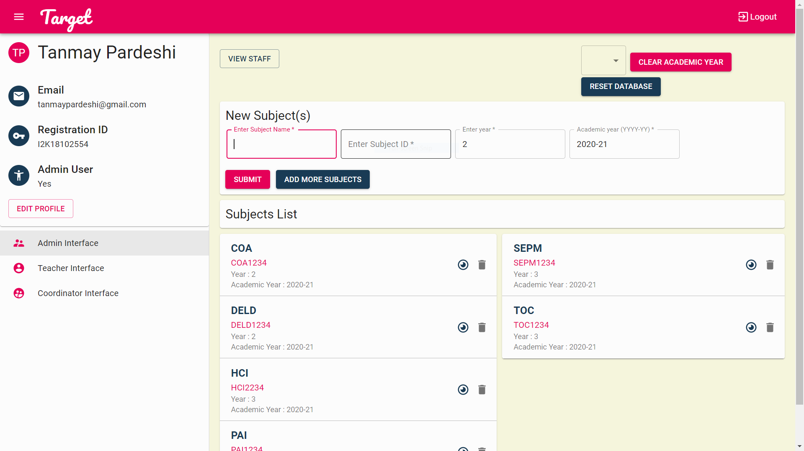
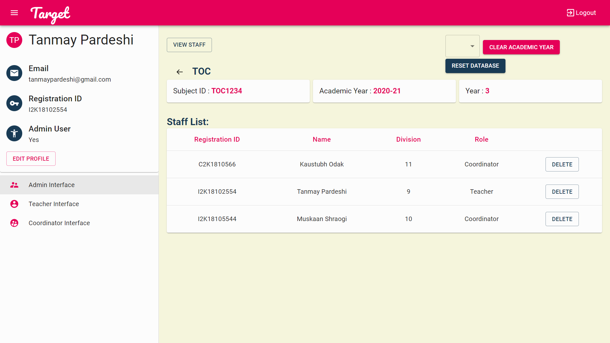
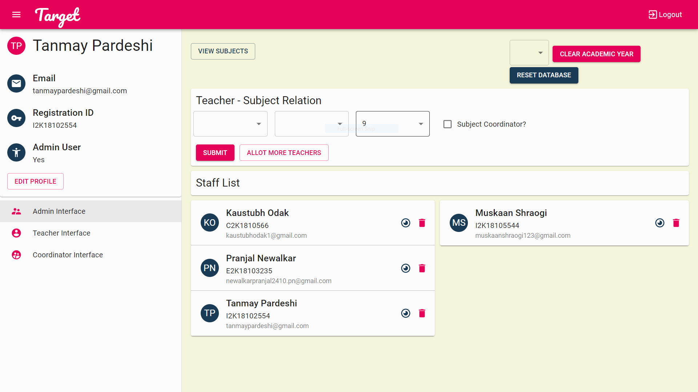
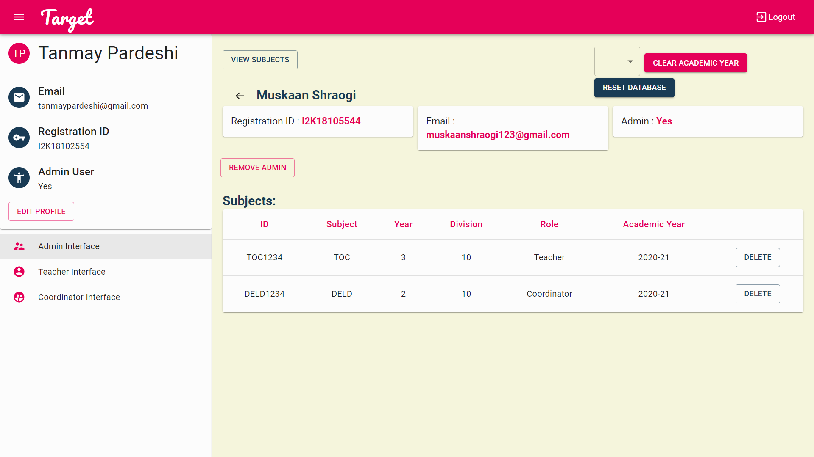
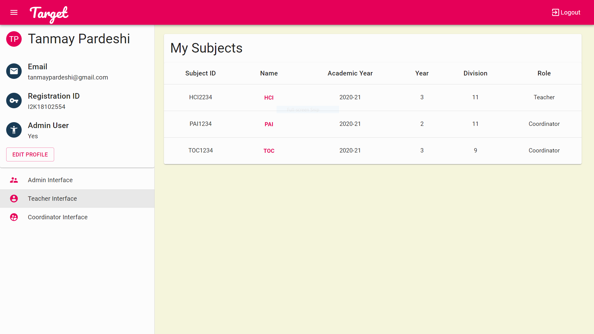
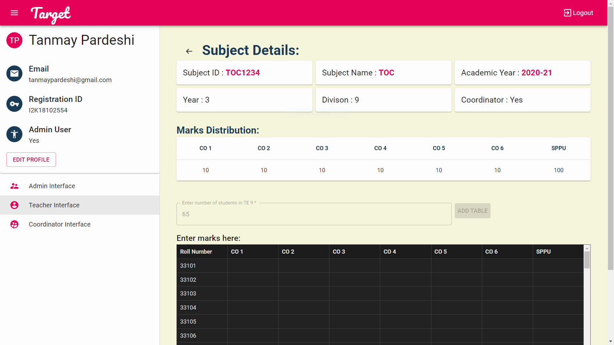
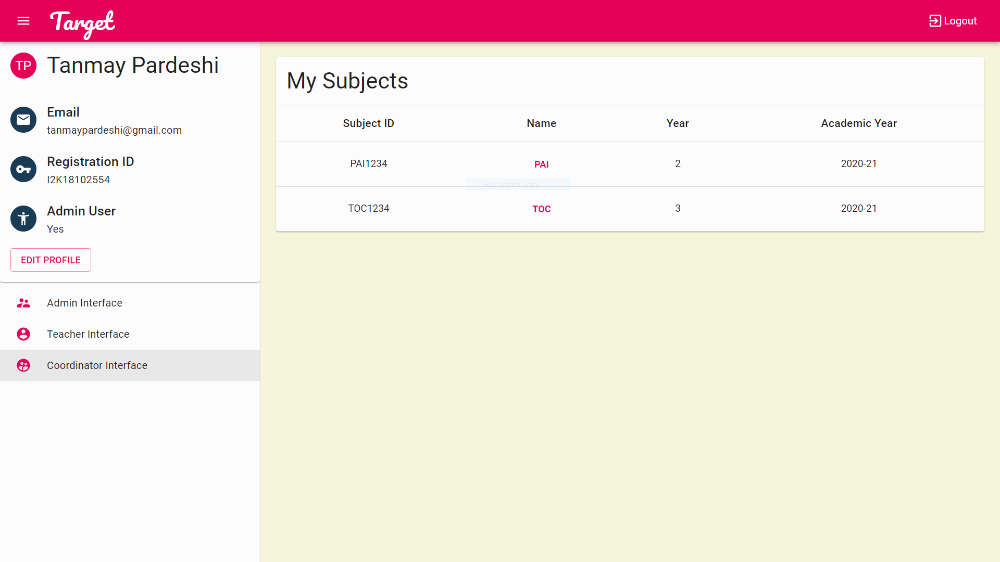
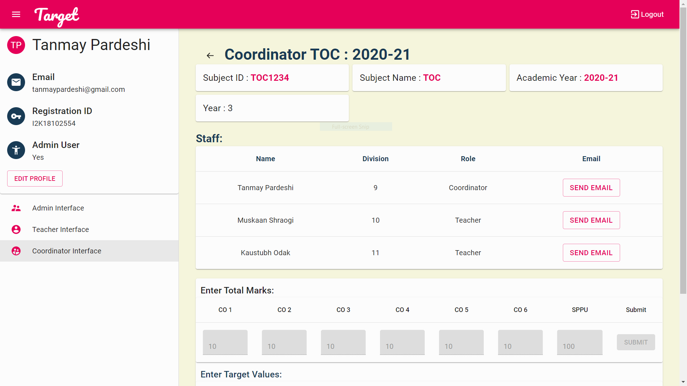

# Target

## Automatic NBA CO Attainment Calculator 

Calculation of termwork, internal scores and attainment is one of the more essential parts of the working of any institute. Trying to automate this process is what our project focuses on. We have created an extremely intuitive portal which makes it easier for the staff members to communicate with their respective subject heads and keep a track of individual student assessment. We used MySQL as the database backend along with NodeJS and ExpressJS. React was used to make a clean interface.

## Prequisites on the local machine to project to be run:

1. Node JS v12.x or above 
2. Yarn v1.22.x or npm v6.x or above

## Steps to run the project on the local machine

1. Clone this repository into your local machine by using  
    `git clone https://github.com/tanmaypardeshi/Target.git`

* ### Setting up the node.js local server:

1. cd into the <i>backend</i> directory.
2. Use command **yarn** to install node modules for the front end.
3. Once the node modules have been installed, run **yarn start** to start the development server.

* ### Setting up the react local server:

1. cd into the <i>frontend</i> directory.
2. Use command **yarn** to install node modules for the front end.
3. Keep the node server up and running to make the website functional.
4. Once the node modules have been installed, run **yarn start** to start the development server.

## Snippets of the platform : 

**Login and registration:**

    
    

**Admin Interface:**

    
    

    
    

**Teacher Interface:**

    
    

**Coordinator Interface:**

    
    

